<p align="center">
  
</p>

Undertone is a small, dependency-free procedural synth engine for games — one-shot sound effects _and_ polyphonic pattern-based music, built directly on the Web Audio API. Everything is a pattern: a UI blip is a pattern you play once, a melody is a pattern you loop.

## Features

- **Zero runtime dependencies.** Pure TypeScript on top of `AudioContext`/`OscillatorNode`/`GainNode`/`BiquadFilterNode`/`StereoPannerNode`/`ChannelMergerNode`/`AudioBufferSourceNode`.
- **Mini-notation** — `note('c3 [e3 g3] <a3 b3> ~')` — sequences, subdivision, per-cycle alternation, rests, chords, replication, elongation, and euclidean rhythms in one string.
- **Pattern combinators**: `fast`, `slow`, `rev`, `every`, `euclid`, `jux`, `stack`, `seq`, `cat` — all immutable, all composable, with exact rational cycle time underneath (triplets never drift).
- **Chainable, immutable voice controls** — `.sound()`, ADSR, `.gain()`, lowpass filter + filter envelope, `.slide()`, `.nudge()` — applied across every event of a pattern.
- **Polyphony everywhere**: chords via `[c3,e3,g3]`, layers via `stack()`, overlapping voices each get their own node graph.
- **One-shot or looped**: `pattern.play()` fires a single cycle (percussive envelopes, exactly right for game SFX); `pattern.loop({ bpm })` runs a lookahead cycle scheduler where each note's envelope is gated by its event length.
- **Stereo and up-to-7.1 placement**: `.pan(-1..1)`, `.channels([...])` per-speaker gains, `.surround(angle)` equal-power placement on the speaker ring — with automatic stereo fold-down on plain hardware.
- **Fully unit-tested**, including the actual Web Audio node graph, envelope automation timing, and the loop scheduler, against a hand-written fake `AudioContext`.

## Why not Strudel?

The API is deliberately Strudel-flavoured (`note()`, mini-notation, `stack()`, `jux(rev)`) because that's a genuinely pleasant way to describe both a synth voice and a musical pattern. But [Strudel](https://strudel.cc) itself is AGPL-3.0-or-later licensed, which conflicts with permissively-licensed projects that want to bundle it into a shipped client. Undertone is a clean-room implementation: the pattern engine is built from the published TidalCycles papers and public documentation of the mini-notation semantics, never from Strudel's source, and covers a deliberately small subset — a lightweight synth voice, one-shot SFX, and enough of the pattern/cycle vocabulary to write real game music.

## Installation

```bash
bun add @liminal-hq/undertone
# or: npm install @liminal-hq/undertone
```

## Usage

A one-shot game sound effect (percussive, fire-and-forget):

```ts
import { note, sound, stack } from '@liminal-hq/undertone';

const placeBuilding = stack(
  note('c2')
    .sound('triangle')
    .attack(0.001)
    .decay(0.1)
    .release(0.05)
    .gain(0.9)
    .lpf(220)
    .slide(0.07),
  note('c6').sound('sine').attack(0.001).decay(0.15).gain(0.3).lpf(2000).nudge(0.02),
  sound('white').attack(0).decay(0.02).release(0.01).gain(0.4).lpf(4000)
);

// Later, on a user gesture (autoplay policy):
placeBuilding.play();
```

Looped, polyphonic music from mini-notation:

```ts
import { note, rev, stack } from '@liminal-hq/undertone';

const music = stack(
  note('<[c3,e3,g3] [a2,c3,e3] [f2,a2,c3] [g2,b2,d3]>') // one chord per cycle
    .sound('sine')
    .sustain(0.8),
  note('c5 [e5 g5] <b5 a5> ~').sound('triangle').every(2, rev).jux(rev).gain(0.4),
  note('c2(3,8)').sound('square').lpf(400) // euclidean bassline
);

const handle = music.loop({ bpm: 110 });
// ... later:
handle.stop();
```

See `demo/` for a runnable local playground with a live pattern editor (`bun run demo`), or the deployed version at [liminalhq.ca/undertone](https://liminalhq.ca/undertone/).

## Mini-notation

`note()` and `sound()` accept a mini-notation string. Within one cycle:

| Notation    | Meaning                                                                  |
| ----------- | ------------------------------------------------------------------------ |
| `a b c`     | Sequence: the cycle is divided equally between the steps.                |
| `~`         | Rest.                                                                    |
| `[a b]`     | Subdivision: a nested sequence inside one step.                          |
| `<a b>`     | Alternation: a different child each cycle.                               |
| `a,b`       | Parallel: both play at once (chords, layers).                            |
| `a*2` `a/2` | Speed the step up / slow it down.                                        |
| `a!3`       | Replicate the step (same as writing it three times).                     |
| `a@3`       | Elongate: the step takes 3 shares of the cycle.                          |
| `a(3,8)`    | Euclidean rhythm: 3 onsets spread over 8 slots; `a(3,8,1)` rotates by 1. |

## Scales

`n(input)` starts a scale-degree pattern — `input` is a raw integer, or a mini-notation string of
them (`"0 2 4 <1 3>"`), just like `note()`. Chain `.scale("D5:minor")` to resolve those degrees
into real pitches: the root is a note name + octave, the name is one of `major`/`ionian`,
`minor`/`aeolian`, `dorian`, `phrygian`, `lydian`, `mixolydian`, `locrian`, `harmonicMinor`,
`melodicMinor`, `majorPentatonic`, `minorPentatonic`, `chromatic` (case-insensitive, spaces/hyphens
ignored). Degrees beyond the scale's own length carry the octave (`n('7').scale('c4:major')` is
`c5`); negative degrees descend the same way. Events built with `note()` (already pitched) pass
through `.scale()` unchanged, so `n()` and `note()` can be freely mixed in a `stack()`.

## API

| Call                                                     | What it does                                                                                                                                         |
| -------------------------------------------------------- | ---------------------------------------------------------------------------------------------------------------------------------------------------- |
| `note(input)`                                            | Pattern of pitched voices (default sound: sine). `input` is a note name (`"c2"`, `"f#3"`), a raw Hz number, or a mini-notation string of them.       |
| `sound(input)`                                           | Pattern of unpitched voices — the entry point for noise (`'white' \| 'pink' \| 'brown'`), also accepts mini-notation.                                |
| `n(input)` `.scale(spec)`                                | Scale-degree pattern (`n('0 2 4')`) resolved into real pitches by `.scale("D5:minor")`. `spec` is `"<root><octave>:<name>"`; see Scales below.       |
| `stack(...pats)` `seq(...pats)` `cat(...pats)`           | Combine patterns: simultaneously / sequentially within a cycle / one per cycle.                                                                      |
| `arrange([cycles, pat], ...)`                            | Plays each pattern for its own span of whole cycles, looping the whole arrangement once the total is reached — the backbone of a multi-section song. |
| `.fast(n)` `.slow(n)`                                    | Speed the whole pattern up or down.                                                                                                                  |
| `.rev()`                                                 | Reverse each cycle (also exported standalone as `rev` for `jux(rev)`).                                                                               |
| `.every(n, fn)`                                          | Apply `fn` to the pattern every nth cycle.                                                                                                           |
| `.euclid(pulses, steps, rot?)`                           | Distribute the pattern over a euclidean rhythm.                                                                                                      |
| `.jux(fn)`                                               | Original hard left, `fn(pattern)` hard right.                                                                                                        |
| `.sound(type)`                                           | Waveform or noise type: `'sine' \| 'triangle' \| 'square' \| 'sawtooth' \| 'white' \| 'pink' \| 'brown'`.                                            |
| `.attack(s)` `.decay(s)` `.sustain(level)` `.release(s)` | Amplitude envelope. One-shots are percussive; in `loop()` the envelope holds at `sustain` until the event's gate ends.                               |
| `.gain(level)`                                           | Peak amplitude (0-1).                                                                                                                                |
| `.lpf(hz)`                                               | Base lowpass filter cutoff. Omit entirely to skip filtering.                                                                                         |
| `.lpenv(hz)` `.lpa(s)` `.lpd(s)` `.lps(level)` `.lpr(s)` | Filter envelope — same shape as the amplitude envelope, ranging between `lpf` and `lpf + lpenv`.                                                     |
| `.slide(s)`                                              | Pitch glide: starts an octave above the target note and slides down over `s` seconds.                                                                |
| `.nudge(s)` `.late(s)` `.early(s)`                       | Start-time offset in seconds for every event (`late`/`early` are signed aliases of `nudge`).                                                         |
| `.pan(p)`                                                | Stereo position, -1 (left) to 1 (right).                                                                                                             |
| `.channels(gains)` `.surround(angle)`                    | Multichannel placement (up to 7.1): raw per-speaker gains in FL, FR, C, LFE, SL, SR, RL, RR order, or an angle on the speaker ring.                  |
| `.play(options?)`                                        | One-shot: schedules one cycle's worth of events. `{ ctx?, bpm?, when? }`.                                                                            |
| `.loop(options?)`                                        | Loops with a lookahead scheduler; returns a handle with `stop()`. `{ ctx?, bpm?, timer? }`.                                                          |
| `enableMultichannel(ctx)`                                | Opts the context's destination into its full hardware channel count (call once); without it, multichannel voices fold down to stereo.                |
| `mini(source, leaf)` `pure(v)` `silence` `timecat(...)`  | Lower-level pattern building blocks, exported for power users.                                                                                       |

Tempo: `bpm` counts four beats per cycle; the default 120 bpm means 2-second cycles. When no `ctx` is passed, a shared `AudioContext` is created lazily on first use — trigger the first `play()`/`loop()` from a user gesture (autoplay policy).

**Patterned parameters:** every numeric control above (`attack`, `decay`, `sustain`, `release`, `gain`, `lpf`, `lpenv`, `lpa`, `lpd`, `lps`, `lpr`, `slide`, `nudge`/`late`/`early`, `pan`) also accepts a mini-notation string instead of a plain number — `.gain(".1 .2 .3 .4")`, `.pan("<.25 .75>")`. Structure comes from the pattern it's called on: at each event's onset, whichever control step covers that instant supplies the value, and a rest (`~`) in the control leaves that event's value unset.

## Development

```bash
bun install
bun run test          # vitest
bun run lint           # eslint
bun run build          # tsc -> dist/
bun run demo            # local playground at http://localhost:5173
```

## License

MIT
