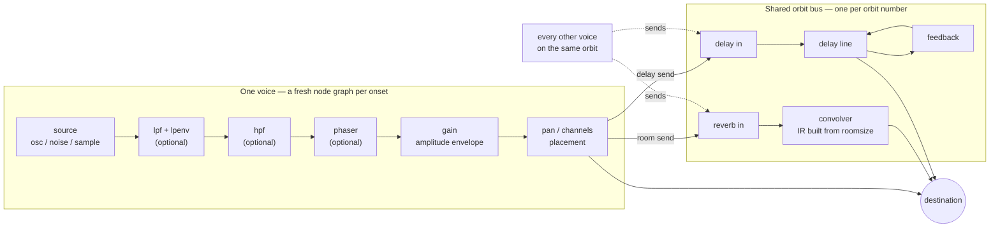
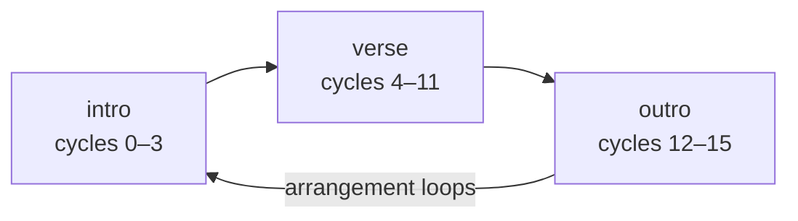

# The undertone guide

This is the narrative companion to the [README's API reference](../README.md#api) — a walkthrough for someone who has skimmed the feature list but hasn't written any undertone code yet. The README tables stay the definitive one-line-per-call reference; this guide explains how the pieces fit together, in the order you'll actually meet them, with runnable examples throughout.

## The mental model: everything is a pattern

Undertone has exactly one central idea. A `Pattern` is a description of events laid out across _cycles_ of abstract time — it doesn't make sound, hold audio nodes, or know about the clock. Every constructor (`note()`, `sound()`, `n()`, `chord()`, `s()`) returns a pattern; every chained method (`.gain()`, `.lpf()`, `.fast()`, `.every()`) returns a _new_ pattern wrapping the old one, so patterns are immutable and always safe to branch, reuse, and combine.

Sound happens only at the very end, in one of two ways:

- `.play()` fires **one cycle, once** — the events are realized as percussive voices and forgotten. This is the game-SFX path: a click, a thunk, a fanfare.
- `.loop({ bpm })` runs the pattern **forever** on a lookahead scheduler — each event's envelope is _gated_ by the event's length, which is what turns the same pattern machinery into held notes and grooves. It returns a handle whose `stop()` ends the loop.

Once you hold onto this, the rest of the API is just vocabulary: mini-notation describes _when_ events happen within a cycle, the chainable controls describe _what_ each voice sounds like, and the combinators (`stack`, `seq`, `cat`, `arrange`) glue patterns into bigger patterns. A UI blip, a bassline, and an entire multi-section song are all the same kind of object.

## Your first sound

```ts
import { note } from '@liminal-hq/undertone';

// Call this from a click handler or other user gesture:
note('c5').sound('triangle').decay(0.1).gain(0.5).play();
```

Line by line:

- `note('c5')` builds a pattern containing a single pitched event per cycle — C in the fifth octave. Note names are letter + optional `#`/`b` accidental + octave (`'c2'`, `'f#3'`, `'bb3'`); a raw Hz number works too (`note(440)`).
- `.sound('triangle')` picks the oscillator waveform. The choices are `'sine'` (the default), `'triangle'`, `'square'`, `'sawtooth'`, plus three noise colours `'white' | 'pink' | 'brown'`.
- `.decay(0.1)` shapes the amplitude envelope. The defaults are already percussive (fast attack, short decay, sustain 0), so a one-shot sounds like a blip without any envelope calls at all — this just shortens it.
- `.gain(0.5)` sets peak amplitude, 0 to 1.
- `.play()` schedules one cycle's worth of events on an `AudioContext` and returns immediately.

The one environmental catch: when you don't pass your own context, undertone lazily creates a shared `AudioContext` on first use, and browsers refuse to start audio outside a user gesture (autoplay policy). Make sure the _first_ `play()` or `loop()` in your app happens inside a click/keypress/tap handler; after that, fire away from anywhere.

For a richer one-shot, layer voices with `stack()` — this is the placed-building sound from `demo/placeBuilding.ts`, a low thunk plus a high sparkle plus a noise click, all starting together:

```ts
import { note, sound, stack } from '@liminal-hq/undertone';

const placeBuilding = stack(
  note('c2')
    .sound('triangle')
    .attack(0.001)
    .decay(0.1)
    .release(0.05)
    .gain(0.9)
    .lpf(220)
    .slide(0.07),
  note('c6').sound('sine').attack(0.001).decay(0.15).gain(0.3).lpf(2000).nudge(0.02),
  sound('white').attack(0).decay(0.02).release(0.01).gain(0.4).lpf(4000)
);

placeBuilding.play();
```

`.nudge(0.02)` offsets a voice's start by seconds (great for arpeggiated one-shots), and `.slide(0.07)` glides the pitch down from an octave above — the classic downward "thunk".

## Mini-notation, one step at a time

Writing one event per pattern gets old fast. `note()`, `sound()`, `n()`, `chord()`, and `s()` all accept a mini-notation string that describes a whole cycle of events; the [README's mini-notation table](../README.md#mini-notation) is the compact reference, and this section walks the same syntax in the order it's worth learning. The examples below use `.loop()` so you can hear the cycle repeat — call `handle.stop()` when you've heard enough.

**Sequence.** Space-separated steps divide the cycle equally. Four steps at the default 120 bpm (a 2-second cycle) means one note every half second:

```ts
const handle = note('c4 e4 g4 b4').sound('triangle').loop({ bpm: 120 });
```

**Rests.** `~` is a step of silence, taking up its share of the cycle like any other step:

```ts
note('c4 ~ e4 ~').sound('triangle').loop({ bpm: 120 });
```

**Subdivision.** Square brackets nest a sequence inside one step — the bracketed group splits its parent step's time, so rhythms subdivide naturally:

```ts
note('c4 [e4 g4] c4 [e4 g4 b4]').sound('triangle').loop({ bpm: 120 });
```

**Alternation.** Angle brackets play a _different child each cycle_ — `<b3 c4>` is `b3` on the first pass, `c4` on the next, and so on. This is the cheapest way to make a short pattern feel longer than one cycle:

```ts
note('c3 e3 g3 <b3 c4>').sound('triangle').loop({ bpm: 140 });
```

One nuance worth knowing early: `.play()` plays cycle zero only, so an alternation in a one-shot always plays its first option. Alternation is a looping construct.

**Chords and layers.** A comma means "at the same time" — inside brackets it's a chord; at the top level it layers independent sequences (a polyrhythm, since each side divides the cycle its own way):

```ts
note('<[c3,e3,g3] [a2,c3,e3] [f2,a2,c3] [g2,b2,d3]>').sound('sine').sustain(0.8).loop({ bpm: 80 });
note('[c4 e4 g4, c2 f2]').sound('triangle').loop({ bpm: 110 }); // 3 against 2
```

**Speed, replication, elongation.** `a*2` squeezes two repeats of a step into its slot, `a/2` stretches it over two cycles, `a!3` writes the step three times, and `a@3` gives it three shares of the cycle instead of one:

```ts
note('c4@3 g4').sound('triangle').loop({ bpm: 120 }); // long c, short g
```

**Euclidean rhythms.** `a(3,8)` distributes 3 onsets as evenly as possible over 8 slots (the tresillo `x..x..x.`); a third argument rotates the result. Layered euclideans with different pulse counts are an instant groove:

```ts
note('[c2(3,8), g2(5,8,2), c4(7,16,4)]').sound('square').sustain(0.12).lpf(900).loop({ bpm: 130 });
```

Everything composes: `<c5 e5 g5 b5 a5 g5>*2 ~` alternates _and_ doubles _and_ rests, and the same string syntax works inside `n()`, `chord()`, `s()`, and (as you'll see below) every numeric control.

## Looping, note length, and tempo

`.play()` and `.loop()` differ in more than repetition — they treat the envelope differently, and this is the detail that makes looped patterns sound like music instead of a stream of clicks.

The amplitude envelope is a standard ADSR: `.attack(s)` ramps to peak, `.decay(s)` falls to `sustain × peak`, `.release(s)` ramps back to silence. In a one-shot, release starts as soon as decay lands — percussive, no hold, which is exactly right for SFX and is why the default `sustain` is `0`. In a loop, each event knows its _length_ (its share of the cycle at the current tempo), and the envelope **holds at the sustain level until that length is up** before releasing — the event is "gated" by its note length. A whole note and a sixteenth note built from the same voice sound different in a loop; in a one-shot they'd be identical blips.

The practical consequence: **a held sound in a loop needs a non-zero sustain**. With the default `sustain: 0` there is nothing to hold (the engine doesn't even bother gating — the voice is silent after its decay regardless), so a chorale patch wants something like `.sustain(0.8)` while a plucky bassline might want `.sustain(0.1)` or none at all.

```ts
import { note, rev, stack } from '@liminal-hq/undertone';

const music = stack(
  note('<[c3,e3,g3] [a2,c3,e3] [f2,a2,c3] [g2,b2,d3]>').sound('sine').sustain(0.8),
  note('c5 [e5 g5] <b5 a5> ~').sound('triangle').every(2, rev).jux(rev).gain(0.4),
  note('c2(3,8)').sound('square').lpf(400)
);

const handle = music.loop({ bpm: 110 });
// ... later:
handle.stop();
```

Tempo: `bpm` counts four beats per cycle, so the default 120 bpm means 2-second cycles and a 4-step sequence lands one step per beat. If you'd rather set tempo once instead of passing `{ bpm }` everywhere, `setcpm(cyclesPerMinute)` sets a default in cycles per minute (`setcpm(30)` is the same speed as `bpm: 120`); an explicit `bpm` on any call still wins, and `resetTempo()` clears the override.

`stop()` stops _scheduling_ — voices already handed to the audio clock (the scheduler looks ahead about a third of a second) finish their envelopes and ring out rather than being cut off mid-note.

Pattern-level transforms are worth experimenting with here, since they only reveal themselves over multiple cycles: `.fast(n)`/`.slow(n)` rescale time, `.rev()` mirrors each cycle, `.every(n, fn)` applies a transform every nth cycle (`pat.every(4, rev)`), `.euclid(pulses, steps)` redistributes any pattern onto a euclidean grid, and `.jux(fn)` plays the original hard left with a transformed copy hard right — `pat.jux(rev)` is the classic stereo shimmer.

## Melody and harmony

Writing every pitch out as note names works, but scale degrees and chord symbols are usually what you're actually thinking in. Both are patterns like everything else, so they mix freely with `note()` in a `stack()`.

**Scale degrees.** `n()` takes integers (or a mini-notation string of them) and `.scale('D5:minor')` resolves them against a named scale — root note + octave, colon, scale name (`major`, `minor`, `dorian`, `mixolydian`, `harmonicMinor`, `majorPentatonic`, and friends — the [README's Scales section](../README.md#scales) has the full list). Degrees past the scale's length wrap up an octave (`7` in a 7-note scale is the root an octave up), and negative degrees descend the same way, so runs and octave jumps are just arithmetic:

```ts
import { n } from '@liminal-hq/undertone';

n('0 2 4 <7 -3>').scale('d5:minor').sound('triangle').sustain(0.3).loop({ bpm: 130 });
```

**Chord symbols.** `chord()` takes symbols like `Dm9`, `BbM7`, `A7sus` and `.voicing()` expands each one into simultaneous pitched notes, exactly as if you'd written a `[d3,f3,a3,c4,e4]` chord in mini-notation. Voicing is deterministic and anchored around middle C by default (`.voicing({ anchor: 'g4' })` to taste), and same-root changes share common tones so progressions don't leap around. Case matters in qualities: `M7` is a major seventh, `m7` a minor seventh — see the [README's Chords section](../README.md#chords) for the supported vocabulary.

**Putting them together.** Since already-pitched events pass through `.scale()` and `.voicing()` untouched, a progression, a bassline, and a melody are three patterns stacked:

```ts
import { chord, n, note, stack } from '@liminal-hq/undertone';

const progression = chord('<Dm9 BbM7 Gm9 A7sus>').voicing().sound('sine').sustain(0.8).gain(0.35);

const bass = note('<d2 bb1 g1 a1>(3,8)').sound('square').sustain(0.2).lpf(500).gain(0.5);

const melody = n('<0 2 4 5 4 2 1 0>*2 ~')
  .scale('d5:minor')
  .sound('triangle')
  .sustain(0.25)
  .gain(0.3);

const handle = stack(progression, bass, melody).loop({ bpm: 96 });
```

The alternations line up because they all cycle at the same rate: each cycle gets one chord, the matching bass root, and the next two melody degrees.

## Samples

Undertone bundles no samples and fetches nothing by default — sample playback is strictly bring-your-own-assets. The flow is: register names, optionally preload, then play them with `s()` exactly like synth voices.

```ts
import {
  loadSamples,
  note,
  registerSample,
  registerSamples,
  s,
  stack
} from '@liminal-hq/undertone';

registerSamples({
  bd: '/audio/kick.wav',
  sd: '/audio/snare.wav',
  hh: '/audio/hat.wav'
});
registerSample('bass', { url: '/audio/pluck-e1.wav', baseNote: 'e1' });

// Optional but recommended: decode everything up front so the first
// cycle isn't missing voices while decoding is still in flight.
const ctx = new AudioContext();
await loadSamples(ctx);

const kit = stack(
  s('bd ~ [bd bd] sd'),
  s('hh*8').gain(0.4),
  note('e1 ~ g1 a1').s('bass').sustain(0.5)
);
const handle = kit.loop({ ctx, bpm: 100 });
```

The pieces:

- `registerSample(name, source)` points a name at a URL (fetched with plain `fetch()` when first needed), an already-downloaded `ArrayBuffer`, an already-decoded `AudioBuffer`, or a `{ url?, data?, buffer?, baseNote? }` object. `registerSamples({ ... })` registers many at once. Registration is cheap and synchronous — nothing is fetched or decoded yet.
- `baseNote` declares the pitch the recording actually sounds at (default `'c4'`). When a sample plays a pitched event — `note('e1 g1').s('bass')` — the playback rate is the ratio of the event's frequency to the base note's, so one recording covers a melody. A typo'd `baseNote` throws immediately at `registerSample()` time (eager validation, recently fixed to fail fast) rather than surfacing later mid-playback.
- `loadSamples(ctx, names?)` preloads and decodes — everything registered, or just the given names. It's optional: playback also decodes on demand, but an onset whose sample is still decoding is _skipped for that one onset_ and picked up by later onsets once decoding finishes. For a loop that's a missing beat or two at the start; for a one-shot it can mean silence, so preload anything you'll `play()`.
- `s('bd sd hh')` is the constructor, and `.s(name)` the chainable equivalent for putting a sample on an already-built pattern. Any word that matches one of the seven synth types (`sine`, `white`, ...) behaves exactly like `sound()`; anything else is a sample name, validated against the registry at play time (since you might register after building the pattern).
- `.bank(name)` is a lookup convention, not a loader: it tries `${bank}_${sampleName}` before the bare name, so after `registerSample('TR707_bd', ...)`, `s('bd').bank('TR707')` finds it — handy for swapping kits by changing one call.

Two behaviours worth knowing. First, an _unregistered_ name never throws during playback — the voice is skipped silently with a once-per-name console warning (`undertone: sample "xyz" is not registered`), because a hard throw inside the loop scheduler would take the whole pattern down. Check the console when a layer is mysteriously absent. Second, sample voices default to `sustain: 1` (hold, not the percussive synth default), so a gated loop event lets the recording ring for its full note length — but a one-shot `.play()` has no gate, so its envelope releases right after the decay (about 0.16 s on defaults). To hear a sample ring out in a one-shot, give it room explicitly, e.g. `.decay(1)` for a second of full-level playback before the release.

You are responsible for the legal status of whatever you register — undertone deliberately points at no sample library, Strudel's CDN included.

## Shaping the voice: filters and effects

Each onset builds its own little node graph. In series: the source (oscillator, noise buffer, or sample), an optional lowpass filter with its own envelope, an optional static highpass, an optional 4-stage phaser, the amplitude-envelope gain, and finally stereo/surround placement. None of the optional stages creates a node unless you ask for it. From the placed signal, optional _sends_ branch off to a shared reverb/delay bus:



**The lowpass and its envelope.** `.lpf(hz)` sets the resting cutoff; `.lpenv(hz)` adds a filter envelope that sweeps between `lpf` and `lpf + lpenv`, shaped by its own ADSR (`.lpa`/`.lpd`/`.lps`/`.lpr`, same semantics as the amplitude envelope). A slow filter attack over a sawtooth is the classic rising-sweep — this is `demo/powerOn.ts` almost verbatim:

```ts
note('a3')
  .sound('sawtooth')
  .attack(0.02)
  .decay(0.14)
  .sustain(0.4)
  .release(0.1)
  .gain(0.35)
  .lpf(300)
  .lpenv(2200)
  .lpa(0.16)
  .lpd(0.05)
  .lps(0.6)
  .lpr(0.1)
  .play();
```

**Highpass and phaser.** `.hpf(hz)` is a static highpass in series after the lowpass — thin out a pad or keep a noise layer out of the bass. `.phaser(rateHz)` inserts four allpass stages swept together by one LFO at the given rate; try `0.5`–`2` Hz on a sustained voice.

**Reverb and delay are sends, not inserts.** `.room(level)` and `.delay(level)` (both 0–1) control how much of the voice is _sent_ to a shared bus; the dry signal always reaches the destination at full strength. The bus itself is configured by `.roomsize(size)` (decay character, roughly 1 short to 10 long — it procedurally regenerates the reverb's impulse response, only when the value actually changes) and `.delaytime(s)`/`.delayfeedback(amount)` for the delay line. Sends branch off _after_ placement, so the wet signal follows the voice's pan.

**Why orbits exist.** A convolver-based reverb is one of the most expensive nodes Web Audio has, and undertone creates a fresh node graph per onset — a busy song can run 15–20 simultaneous voices, and a convolver per voice would be unshippable. So reverb and delay live on shared per-orbit buses: every voice sending to the same orbit number (default 0) feeds one convolver and one delay line. The cost is shared state — `roomsize`, `delaytime`, and `delayfeedback` are last-writer-wins across every voice on the orbit. When two layers need genuinely different rooms (a tight slap on the drums, a wash on the pad), give each its own `.orbit(n)`:

```ts
const pad = chord('<Dm9 Gm9>')
  .voicing()
  .sound('sine')
  .sustain(0.8)
  .gain(0.3)
  .room(0.5)
  .roomsize(8)
  .orbit(1);

const pluck = n('0 4 2 7')
  .scale('d4:minor')
  .sound('triangle')
  .gain(0.4)
  .delay(0.3)
  .delaytime(0.25)
  .delayfeedback(0.4)
  .orbit(2);

stack(pad, pluck).loop({ bpm: 90 });
```

`.orbit()` takes a plain non-negative integer — it's the one voice control that is _not_ patternable, since it selects a bus rather than shaping a value.

## Patterned parameters

Almost every numeric control accepts a mini-notation string instead of a scalar — `attack`, `decay`, `sustain`, `release`, `gain`, `lpf`, `lpenv`, `lpa`, `lpd`, `lps`, `lpr`, `hpf`, `phaser`, `room`, `roomsize`, `delay`, `delaytime`, `delayfeedback`, `slide`, `nudge`/`late`/`early`, and `pan` all do. The control string is its own little pattern: at each event's onset, whichever control step covers that instant supplies the value.

Before — a flat hi-hat line:

```ts
s('hh*8').gain(0.4).loop({ bpm: 120 });
```

After — the same events, with gain and pan varying per step:

```ts
s('hh*8').gain('[.5 .2 .35 .2]*2').pan('<-0.6 0.6>').loop({ bpm: 120 });
```

The gain string is a four-step curve sped up twice, lining up one value per hat — a strong accent on beats one and three, quieter offbeats in between — and the whole line alternates left/right each cycle via the `<>` in `pan`. The control string divides the cycle its own way and each event samples it at its own onset: without the `*2`, the four gain steps would each cover a quarter of the cycle, so consecutive pairs of hats would share a value. Structure always comes from the pattern being controlled, never from the control string — `.gain('.5 .2 .35 .2')` on a two-note pattern doesn't create extra notes.

A rest in a control string leaves that event's value _unset_ — the engine default (or whatever an earlier chained call set) applies, rather than zero. `.lpf('400 ~ 1600 ~')` gives the second and fourth events no lowpass at all, not a cutoff of 0.

This is the cheapest way to add motion: `.lpf('400 800 1600 3200')` for a filter walk, `.slide('<0 .1>')` for a glide on alternating cycles, `.gain()` for accents. All values are validated eagerly when the pattern is built, so a typo throws at construction time, not mid-song.

## Building a whole track: arrange()

`arrange()` is the backbone of a multi-section song: each entry is `[cycles, pattern]`, sections play back to back for their spans of whole cycles, and the whole arrangement loops once the total is reached.



A small worked example — 4-cycle intro, 8-cycle verse, 4-cycle outro, reusing the harmony-section patterns:

```ts
import { arrange, chord, n, note, stack } from '@liminal-hq/undertone';

const progression = chord('<Dm9 BbM7 Gm9 A7sus>').voicing().sound('sine').sustain(0.8).gain(0.35);
const bass = note('<d2 bb1 g1 a1>(3,8)').sound('square').sustain(0.2).lpf(500).gain(0.5);
const melody = n('<0 2 4 5 4 2 1 0>*2 ~')
  .scale('d5:minor')
  .sound('triangle')
  .sustain(0.25)
  .gain(0.3);

const intro = progression;
const verse = stack(progression, bass, melody);
const outro = stack(progression, bass);

const song = arrange([4, intro], [8, verse], [4, outro]);
const handle = song.loop({ bpm: 96 }); // 16 cycles ≈ 40 s per pass, then round again
```

Each section experiences its _own_ cycles starting from zero whenever its span begins: the verse's `<Dm9 BbM7 Gm9 A7sus>` alternation always opens on `Dm9`, no matter that the verse starts at overall cycle 4. That makes sections self-contained — you can develop each one on its own with `.loop()` and then slot it into the arrangement without its alternations shifting.

Since `arrange()` returns an ordinary pattern, everything composes as usual: `arrange(...)` inside a `stack()` (a drum loop that runs under every section), `.fast(2)` on a whole arrangement, or an `arrange()` section that is itself an `arrange()`.

## Stereo and surround placement

`.pan(p)` places a voice in the stereo field, −1 (hard left) to 1 (hard right), and like most controls it takes a mini-notation string. For real multichannel rigs, `.channels([...])` sets raw per-speaker gains in FL, FR, C, LFE, SL, SR, RL, RR order, and `.surround(angleDegrees)` is the friendlier form — equal-power placement at an angle on the 7.1 speaker ring (0° front-centre, ±90° sides, ±180° dead behind). `channels`/`surround` take precedence over `pan` when both are set.

By default a destination stays stereo and multichannel placements fold down automatically. To address real surround speakers, opt the context in once:

```ts
import { enableMultichannel, note } from '@liminal-hq/undertone';

const ctx = new AudioContext();
enableMultichannel(ctx); // widens the destination to the hardware's channel count

note('c4(5,8)').sound('triangle').surround(135).loop({ ctx, bpm: 120 });
```

On plain stereo hardware the same code still sounds right — the fold-down is automatic — so surround placement is safe to ship speculatively.

## Tips, gotchas, and troubleshooting

- **No sound at all, no errors?** The first `play()`/`loop()` must happen inside a user gesture (click, tap, keypress) — browsers block audio contexts created outside one. Every later call can come from anywhere.
- **A sample layer is silent.** Samples need an explicit `registerSample()`/`registerSamples()` before they make sound — an unregistered name is skipped silently, with a single console warning per name. Check the console.
- **The first beat or two of a loop is missing sample hits.** A registered sample still decoding is skipped (without warning) until the decode lands. `await loadSamples(ctx)` before starting playback fixes it.
- **Notes in a loop are all short blips no matter the pattern.** The default envelope is percussive: `sustain` is 0, so there's nothing to hold through the note length. Add `.sustain(0.3)` (or more) to hear event lengths at all.
- **A sample one-shot cuts off after a fraction of a second.** Only `loop()` gates envelopes by note length; `play()` releases right after the decay. Give one-shot samples an explicit `.decay()` roughly the recording's length.
- **`.sound()` after `.s()` replaces the sample.** Deliberate: `.sound('square')` clears a previously set sample name (and `.s('bd')` clears a synth type), so the two never both apply to one voice.
- **Two layers fight over reverb/delay character.** `roomsize`, `delaytime`, and `delayfeedback` configure the _shared orbit bus_, last-writer-wins across every voice on that orbit. Distinct rooms or delay times need distinct `.orbit(n)` numbers.
- **A `~` in a patterned control isn't zero.** `.gain('1 ~')` leaves the second event's gain at its previous/default value (0.8), not silent. To actually silence steps, put the rest in the _note_ pattern, or write an explicit `0`.
- **Tempo maths.** `bpm` counts four beats per cycle — 120 bpm is a 2-second cycle, so `'a b c d'` lands one step per beat. `setcpm()` is cycles per minute directly (`setcpm(30)` ≡ `bpm: 120`); an explicit `bpm` always wins over it.
- **`stop()` isn't a hard mute.** It stops scheduling new events; voices already handed to the audio clock (up to ~0.3 s of lookahead) finish their envelopes and ring out.
- **Errors surface early by design.** Bad note names, chord symbols, scale specs, out-of-range pans, malformed numbers in control strings — all throw when the pattern is _built_, and a bad `baseNote` throws at `registerSample()` time, so a typo can't lurk until the middle of a song.
- **Patterns are immutable.** `pat.fast(2)` returns a new pattern and leaves `pat` untouched — assign the result. The upside: any half-built pattern is safe to reuse in several stacks or arrangement sections.
