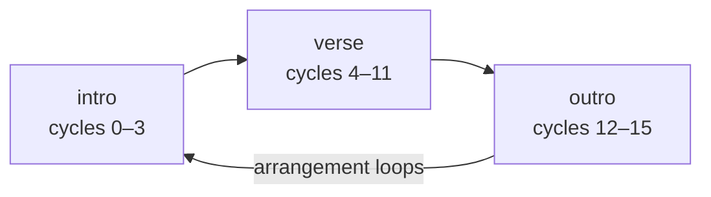

# Building a whole track: arrange()

`arrange()` is the backbone of a multi-section song: each entry is `[cycles, pattern]`, sections play back to back for their spans of whole cycles, and the whole arrangement loops once the total is reached.



A small worked example — 4-cycle intro, 8-cycle verse, 4-cycle outro, reusing the harmony-section patterns:

```ts
import { arrange, chord, n, note, stack } from '@liminal-hq/undertone';

const progression = chord('<Dm9 BbM7 Gm9 A7sus>').voicing().sound('sine').sustain(0.8).gain(0.35);
const bass = note('<d2 bb1 g1 a1>(3,8)').sound('square').sustain(0.2).lpf(500).gain(0.5);
const melody = n('<0 2 4 5 4 2 1 0>*2 ~')
  .scale('d5:minor')
  .sound('triangle')
  .sustain(0.25)
  .gain(0.3);

const intro = progression;
const verse = stack(progression, bass, melody);
const outro = stack(progression, bass);

const song = arrange([4, intro], [8, verse], [4, outro]);
const handle = song.loop({ bpm: 96 }); // 16 cycles ≈ 40 s per pass, then round again
```

Each section experiences its _own_ cycles starting from zero whenever its span begins: the verse's `<Dm9 BbM7 Gm9 A7sus>` alternation always opens on `Dm9`, no matter that the verse starts at overall cycle 4. That makes sections self-contained — you can develop each one on its own with `.loop()` and then slot it into the arrangement without its alternations shifting.

Since `arrange()` returns an ordinary pattern, everything composes as usual: `arrange(...)` inside a `stack()` (a drum loop that runs under every section), `.fast(2)` on a whole arrangement, or an `arrange()` section that is itself an `arrange()`.
