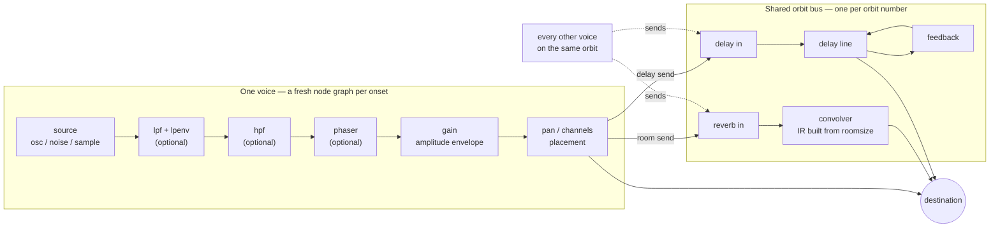

# Shaping the voice: filters and effects

Each onset builds its own little node graph. In series: the source (oscillator, noise buffer, or sample), an optional lowpass filter with its own envelope, an optional static highpass, an optional 4-stage phaser, the amplitude-envelope gain, and finally stereo/surround placement. None of the optional stages creates a node unless you ask for it. From the placed signal, optional _sends_ branch off to a shared reverb/delay bus:



**The lowpass and its envelope.** `.lpf(hz)` sets the resting cutoff; `.lpenv(hz)` adds a filter envelope that sweeps between `lpf` and `lpf + lpenv`, shaped by its own ADSR (`.lpa`/`.lpd`/`.lps`/`.lpr`, same semantics as the amplitude envelope). A slow filter attack over a sawtooth is the classic rising-sweep — this is `demo/powerOn.ts` almost verbatim:

```ts
note('a3')
  .sound('sawtooth')
  .attack(0.02)
  .decay(0.14)
  .sustain(0.4)
  .release(0.1)
  .gain(0.35)
  .lpf(300)
  .lpenv(2200)
  .lpa(0.16)
  .lpd(0.05)
  .lps(0.6)
  .lpr(0.1)
  .play();
```

**Highpass and phaser.** `.hpf(hz)` is a static highpass in series after the lowpass — thin out a pad or keep a noise layer out of the bass. `.phaser(rateHz)` inserts four allpass stages swept together by one LFO at the given rate; try `0.5`–`2` Hz on a sustained voice.

**Reverb and delay are sends, not inserts.** `.room(level)` and `.delay(level)` (both 0–1) control how much of the voice is _sent_ to a shared bus; the dry signal always reaches the destination at full strength. The bus itself is configured by `.roomsize(size)` (decay character, roughly 1 short to 10 long — it procedurally regenerates the reverb's impulse response, only when the value actually changes) and `.delaytime(s)`/`.delayfeedback(amount)` for the delay line. Sends branch off _after_ placement, so the wet signal follows the voice's pan.

**Why orbits exist.** A convolver-based reverb is one of the most expensive nodes Web Audio has, and undertone creates a fresh node graph per onset — a busy song can run 15–20 simultaneous voices, and a convolver per voice would be unshippable. So reverb and delay live on shared per-orbit buses: every voice sending to the same orbit number (default 0) feeds one convolver and one delay line. The cost is shared state — `roomsize`, `delaytime`, and `delayfeedback` are last-writer-wins across every voice on the orbit. When two layers need genuinely different rooms (a tight slap on the drums, a wash on the pad), give each its own `.orbit(n)`:

```ts
const pad = chord('<Dm9 Gm9>')
  .voicing()
  .sound('sine')
  .sustain(0.8)
  .gain(0.3)
  .room(0.5)
  .roomsize(8)
  .orbit(1);

const pluck = n('0 4 2 7')
  .scale('d4:minor')
  .sound('triangle')
  .gain(0.4)
  .delay(0.3)
  .delaytime(0.25)
  .delayfeedback(0.4)
  .orbit(2);

stack(pad, pluck).loop({ bpm: 90 });
```

`.orbit()` takes a plain non-negative integer — it's the one voice control that is _not_ patternable, since it selects a bus rather than shaping a value.
